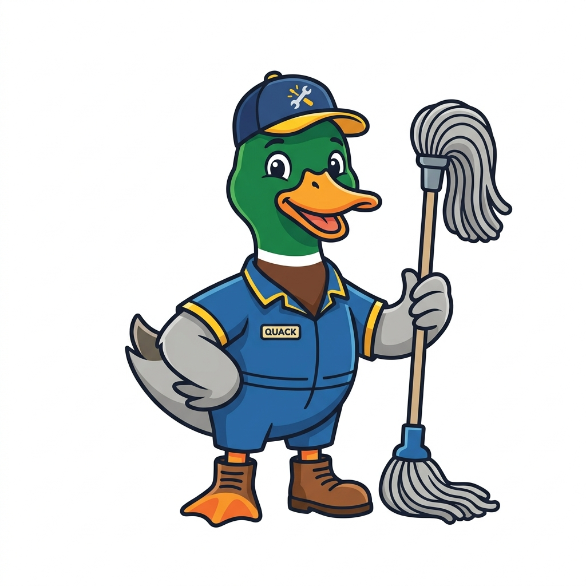

# pyduck-janitor

<p align="center">
  
</p>

**DuckDB-backed pyjanitor for high-performance data cleaning on large datasets**

[](https://opensource.org/licenses/MIT)
[](https://badge.fury.io/py/pyduck-janitor)

The objective of this package is to perform data cleaning using an expressive grammar that coheres with the tidyverse design framework, but powered by [DuckDB](https://duckdb.org/) for high-performance execution on large datasets. The package is centered around data cleaning verbs, supplemented with many utilities for data transformation and manipulation.

## Overview

pyduck-janitor provides a method-chaining API for data cleaning operations that mirrors [pyjanitor](https://pyjanitor-devs.github.io/pyjanitor/), but uses DuckDB as the backend for:

- **Speed**: DuckDB's vectorized execution engine accelerates data cleaning operations
- **Scalability**: Process datasets larger than memory by working directly with Parquet, CSV, or other file formats
- **Lazy evaluation**: Build complex cleaning pipelines that execute efficiently
- **Drop-in replacement**: Use familiar pyjanitor syntax with automatic DuckDB optimization

### The Main Verbs

The core functionality of pyduck-janitor is organized around several main groups of verbs:

1. **`clean_names()`** - Standardize column names to a consistent format
2. **`filter_on()`, `filter_string()`** - Filter rows based on conditions or string patterns
3. **`select_columns()`, `select_rows()`** - Select specific columns or rows
4. **`add_column()`, `remove_columns()`, `rename_column()`** - Modify columns
5. **`dropna()`, `remove_empty()`** - Handle missing data
6. **`coalesce()`, `fill()`, `fill_empty()`** - Impute missing values
7. **`encode_categorical()`, `get_dummies()`** - Encode categorical variables
8. **`transform_column()`, `transform_columns()`** - Transform column values
9. **`case_when()`, `find_replace()`** - Conditional transformations
10. **`pivot_wider()`, `pivot_longer()`** - Reshape data
11. **`groupby_agg()`, `groupby_topk()`** - Grouped operations

## Installation

```bash
pip install pyduck-janitor
```

For the development version:

```bash
cd /home/lucas/.openclaw/workspace/pyduck-janitor
pip install -e ".[dev]"
```

## Quick Start

```python
import pandas as pd
from pyduck_janitor import DuckJanitor

# Load your data
df = DuckJanitor.from_pandas(pd.DataFrame({
    'SalesMonth': ['Jan', 'Feb', 'Mar', 'April'],
    'Company1': [150.0, 200.0, 300.0, 400.0],
    'Company2': [180.0, 250.0, None, 500.0],
    'Company3': [400.0, 500.0, 600.0, 675.0]
}))

# Build a cleaning pipeline
result = (
    df
    .clean_names()
    .remove_columns(['company1'])
    .dropna(subset=['company2', 'company3'])
    .rename_column('company2', 'amazon')
    .add_column('google', [450.0, 550.0, 800.0])
    .collect()
)

print(result)
```

### Select DSL (pyjanitor-compatible)

```python
from pyduck_janitor import DuckJanitor, DropLabel

dj = DuckJanitor.from_pandas(pd.DataFrame({
    'sales_month': ['Jan', 'Feb'],
    'company2': [180.0, 250.0],
    'company3': [400.0, 500.0],
    'notes': ['x', 'y'],
}))

dj.select_columns('sales_month, company2')              # comma-string
dj.select_columns('company*')                           # glob expansion
dj.select_columns('re:^company')                        # regex
dj.select_columns(['company*', DropLabel('company3')])  # exclude one column
```

## Supported Functions

pyduck-janitor implements the **complete pyjanitor documented API** (94/94 functions — verified against the pyjanitor API reference) plus 18 DuckDB-specific extensions, exposed as **109 chainable methods** on `DuckJanitor`.

### Core cleaning verbs (`cleaning_ops.py`)
- [`clean_names()`](https://pyjanitor-devs.github.io/pyjanitor/api/functions/#janitor.functions.clean_names.clean_names) - Clean column names
- [`remove_columns()`](https://pyjanitor-devs.github.io/pyjanitor/api/functions/#janitor.functions.remove_columns.remove_columns) - Remove columns
- [`add_column()`](https://pyjanitor-devs.github.io/pyjanitor/api/functions/#janitor.functions.add_columns.add_column) / [`add_columns()`](https://pyjanitor-devs.github.io/pyjanitor/api/functions/#janitor.functions.add_columns.add_columns) - Add a new column (single or dict form)
- [`rename_column()`](https://pyjanitor-devs.github.io/pyjanitor/api/functions/#janitor.functions.rename_columns.rename_column) / [`rename_columns()`](https://pyjanitor-devs.github.io/pyjanitor/api/functions/#janitor.functions.rename_columns.rename_columns) - Rename a column
- `dropna()` - Drop rows with NA values
- [`remove_empty()`](https://pyjanitor-devs.github.io/pyjanitor/api/functions/#janitor.functions.remove_empty.remove_empty) - Remove empty rows/columns
- [`filter_column()`](https://pyjanitor-devs.github.io/pyjanitor/api/functions/#janitor.functions.filter.filter_column_isin) / [`filter_column_isin()`](https://pyjanitor-devs.github.io/pyjanitor/api/functions/#janitor.functions.filter.filter_column_isin) - Filter by column condition / IS IN list
- [`filter_on()`](https://pyjanitor-devs.github.io/pyjanitor/api/functions/#janitor.functions.filter.filter_on) - Filter with SQL-like criteria
- [`filter_string()`](https://pyjanitor-devs.github.io/pyjanitor/api/functions/#janitor.functions.filter.filter_string) - Filter by substring
- [`coalesce()`](https://pyjanitor-devs.github.io/pyjanitor/api/functions/#janitor.functions.coalesce.coalesce) - Merge columns
- [`encode_categorical()`](https://pyjanitor-devs.github.io/pyjanitor/api/functions/#janitor.functions.encode_categorical.encode_categorical) - Encode as categorical
- `get_dummies()` - One-hot encode
- [`select_columns()`](https://pyjanitor-devs.github.io/pyjanitor/api/functions/#janitor.functions.select.select_columns) / [`select()`](https://pyjanitor-devs.github.io/pyjanitor/api/functions/#janitor.functions.select.select) - Select columns (supports comma-strings, globs, `re:` regex, and [`DropLabel`](https://pyjanitor-devs.github.io/pyjanitor/api/functions/#janitor.functions.select.DropLabel))
- [`select_rows()`](https://pyjanitor-devs.github.io/pyjanitor/api/functions/#janitor.functions.select.select_rows) - Select rows
- [`transform_column()`](https://pyjanitor-devs.github.io/pyjanitor/api/functions/#janitor.functions.transform_columns.transform_column) / [`transform_columns()`](https://pyjanitor-devs.github.io/pyjanitor/api/functions/#janitor.functions.transform_columns.transform_columns) - Transform one or many columns

### Extended verbs (`cleaning_ops_extended.py`)
- [`bin_numeric()`](https://pyjanitor-devs.github.io/pyjanitor/api/functions/#janitor.functions.bin_numeric.bin_numeric) - Bin numeric column
- [`change_type()`](https://pyjanitor-devs.github.io/pyjanitor/api/functions/#janitor.functions.change_type.change_type) - Change column type
- [`concatenate_columns()`](https://pyjanitor-devs.github.io/pyjanitor/api/functions/#janitor.functions.concatenate_columns.concatenate_columns) - Join columns
- [`deconcatenate_column()`](https://pyjanitor-devs.github.io/pyjanitor/api/functions/#janitor.functions.deconcatenate_column.deconcatenate_column) - Split column
- [`drop_constant_columns()`](https://pyjanitor-devs.github.io/pyjanitor/api/functions/#janitor.functions.drop_constant_columns.drop_constant_columns) - Remove constant columns
- [`fill()`](https://pyjanitor-devs.github.io/pyjanitor/api/functions/#janitor.functions.fill.fill_direction) / [`fill_direction()`](https://pyjanitor-devs.github.io/pyjanitor/api/functions/#janitor.functions.fill.fill_direction) - Fill missing values (forward/backward)
- [`fill_empty()`](https://pyjanitor-devs.github.io/pyjanitor/api/functions/#janitor.functions.fill.fill_empty) - Fill empty strings
- [`flag_nulls()`](https://pyjanitor-devs.github.io/pyjanitor/api/functions/#janitor.functions.flag_nulls.flag_nulls) - Flag null values
- [`limit_column_characters()`](https://pyjanitor-devs.github.io/pyjanitor/api/functions/#janitor.functions.limit_column_characters.limit_column_characters) - Truncate column names
- [`min_max_scale()`](https://pyjanitor-devs.github.io/pyjanitor/api/functions/#janitor.functions.min_max_scale.min_max_scale) - Scale to [0,1]
- [`groupby_agg()`](https://pyjanitor-devs.github.io/pyjanitor/api/functions/#janitor.functions.groupby_agg.groupby_agg) - Group and aggregate
- [`groupby_topk()`](https://pyjanitor-devs.github.io/pyjanitor/api/functions/#janitor.functions.groupby_topk.groupby_topk) - Top k per group
- [`case_when()`](https://pyjanitor-devs.github.io/pyjanitor/api/functions/#janitor.functions.case_when.case_when) - Conditional logic
- [`currency_column_to_numeric()`](https://pyjanitor-devs.github.io/pyjanitor/api/functions/#janitor.functions.currency_column_to_numeric.currency_column_to_numeric) - Parse currency
- [`convert_date()`](https://pyjanitor-devs.github.io/pyjanitor/api/functions/#janitor.functions.convert_date.convert_to_date) / [`convert_to_date()`](https://pyjanitor-devs.github.io/pyjanitor/api/functions/#janitor.functions.convert_date.convert_to_date) / [`convert_to_datetime()`](https://pyjanitor-devs.github.io/pyjanitor/api/functions/#janitor.functions.convert_date.convert_to_datetime) - Convert to date/datetime
- [`convert_unix_date()`](https://pyjanitor-devs.github.io/pyjanitor/api/functions/#janitor.functions.convert_date.convert_unix_date), [`convert_excel_date()`](https://pyjanitor-devs.github.io/pyjanitor/api/functions/#janitor.functions.convert_date.convert_excel_date), [`convert_matlab_date()`](https://pyjanitor-devs.github.io/pyjanitor/api/functions/#janitor.functions.convert_date.convert_matlab_date) - Numeric date conversions
- [`truncate_datetime()`](https://pyjanitor-devs.github.io/pyjanitor/api/functions/#janitor.functions.truncate_datetime.truncate_datetime_dataframe) / [`truncate_datetime_dataframe()`](https://pyjanitor-devs.github.io/pyjanitor/api/functions/#janitor.functions.truncate_datetime.truncate_datetime_dataframe) - Truncate datetime
- [`pivot_wider()`](https://pyjanitor-devs.github.io/pyjanitor/api/functions/#janitor.functions.pivot.pivot_wider) / [`pivot_longer()`](https://pyjanitor-devs.github.io/pyjanitor/api/functions/#janitor.functions.pivot.pivot_longer) - Reshape wide/long

### Hybrid verbs (`cleaning_ops_final.py`)
- [`conditional_join()`](https://pyjanitor-devs.github.io/pyjanitor/api/functions/#janitor.functions.conditional_join.conditional_join) - Join with condition
- [`get_dupes()`](https://pyjanitor-devs.github.io/pyjanitor/api/functions/#janitor.functions.get_dupes.get_dupes) - Find duplicate rows
- [`dropnotnull()`](https://pyjanitor-devs.github.io/pyjanitor/api/functions/#janitor.functions.dropnotnull.dropnotnull) - Drop non-null values
- [`expand_column()`](https://pyjanitor-devs.github.io/pyjanitor/api/functions/#janitor.functions.expand_column.expand_column) - Expand delimited column
- [`impute()`](https://pyjanitor-devs.github.io/pyjanitor/api/functions/#janitor.functions.impute.impute) - Impute missing values
- [`jitter()`](https://pyjanitor-devs.github.io/pyjanitor/api/functions/#janitor.functions.jitter.jitter) - Add noise to values
- [`label_encode()`](https://pyjanitor-devs.github.io/pyjanitor/api/functions/#janitor.functions.label_encode.label_encode) - Encode as integers
- [`find_replace()`](https://pyjanitor-devs.github.io/pyjanitor/api/functions/#janitor.functions.find_replace.find_replace) - Replace values
- [`count_cumulative_unique()`](https://pyjanitor-devs.github.io/pyjanitor/api/functions/#janitor.functions.count_cumulative_unique.count_cumulative_unique) - Count unique values
- [`complete()`](https://pyjanitor-devs.github.io/pyjanitor/api/functions/#janitor.functions.complete.complete) - Complete missing combinations
- [`also()`](https://pyjanitor-devs.github.io/pyjanitor/api/functions/#janitor.functions.also.also) - Apply multiple operations
- [`alias()`](https://pyjanitor-devs.github.io/pyjanitor/api/functions/#janitor.functions.alias.alias) - Create column aliases
- [`mutate()`](https://pyjanitor-devs.github.io/pyjanitor/api/functions/#janitor.functions.mutate.mutate) / [`assign()`](https://pyjanitor-devs.github.io/pyjanitor/api/functions/#janitor.functions.mutate.assign) / [`ungroup()`](https://pyjanitor-devs.github.io/pyjanitor/api/functions/#janitor.functions.mutate.ungroup) - Add/modify columns, tidyverse-style verbs
- [`drop_duplicate_columns()`](https://pyjanitor-devs.github.io/pyjanitor/api/functions/#janitor.functions.drop_duplicate_columns.drop_duplicate_columns) - Remove duplicate columns
- [`compare_df_cols()`](https://pyjanitor-devs.github.io/pyjanitor/api/functions/#janitor.functions.compare_df_cols.compare_df_cols) / [`compare_df_cols_same()`](https://pyjanitor-devs.github.io/pyjanitor/api/functions/#janitor.functions.compare_df_cols.compare_df_cols_same) - Compare column contents/shape
- [`join_apply()`](https://pyjanitor-devs.github.io/pyjanitor/api/functions/#janitor.functions.join_apply.join_apply) - Apply function to joined data
- [`process_text()`](https://pyjanitor-devs.github.io/pyjanitor/api/functions/#janitor.functions.process_text.process_text) - Text processing

### pyjanitor parity methods (v0.2.0)

These were added in v0.2.0 to reach 100% coverage of pyjanitor's documented API. Every function in this table has a pyjanitor counterpart — the second column shows how the pyduck-janitor method relates to it (same-name implementation or alias of another pyduck verb). Functions with **no** pyjanitor counterpart are listed separately under [DuckDB-only extensions](#duckdb-only-extensions) — none of them appear in this table.

| pyjanitor function | pyduck-janitor | Notes |
| --- | --- | --- |
| [`rename_columns`](https://pyjanitor-devs.github.io/pyjanitor/api/functions/#janitor.functions.rename_columns.rename_columns) | alias of [`rename_column`](https://pyjanitor-devs.github.io/pyjanitor/api/functions/#janitor.functions.rename_columns.rename_column) | plural form |
| [`truncate_datetime_dataframe`](https://pyjanitor-devs.github.io/pyjanitor/api/functions/#janitor.functions.truncate_datetime.truncate_datetime_dataframe) | alias of [`truncate_datetime`](https://pyjanitor-devs.github.io/pyjanitor/api/functions/#janitor.functions.truncate_datetime.truncate_datetime_dataframe) |
| [`convert_to_date`](https://pyjanitor-devs.github.io/pyjanitor/api/functions/#janitor.functions.convert_date.convert_to_date) / [`convert_to_datetime`](https://pyjanitor-devs.github.io/pyjanitor/api/functions/#janitor.functions.convert_date.convert_to_datetime) | aliases of [`convert_date`](https://pyjanitor-devs.github.io/pyjanitor/api/functions/#janitor.functions.convert_date.convert_to_date) | |
| [`convert_unix_date`](https://pyjanitor-devs.github.io/pyjanitor/api/functions/#janitor.functions.convert_date.convert_unix_date) | same-name port of pyjanitor [`convert_unix_date`](https://pyjanitor-devs.github.io/pyjanitor/api/functions/#janitor.functions.convert_date.convert_unix_date) | `TO_TIMESTAMP`, seconds/millis/micros |
| [`convert_excel_date`](https://pyjanitor-devs.github.io/pyjanitor/api/functions/#janitor.functions.convert_date.convert_excel_date) | same-name port of pyjanitor [`convert_excel_date`](https://pyjanitor-devs.github.io/pyjanitor/api/functions/#janitor.functions.convert_date.convert_excel_date) | Excel serial dates |
| [`convert_matlab_date`](https://pyjanitor-devs.github.io/pyjanitor/api/functions/#janitor.functions.convert_date.convert_matlab_date) | same-name port of pyjanitor [`convert_matlab_date`](https://pyjanitor-devs.github.io/pyjanitor/api/functions/#janitor.functions.convert_date.convert_matlab_date) | MATLAB datenums |
| [`excel_time_to_numeric`](https://pyjanitor-devs.github.io/pyjanitor/api/functions/#janitor.functions.convert_date.excel_time_to_numeric) | same-name port of pyjanitor [`excel_time_to_numeric`](https://pyjanitor-devs.github.io/pyjanitor/api/functions/#janitor.functions.convert_date.excel_time_to_numeric) | Excel time fraction → seconds |
| [`sas_numeric_to_date`](https://pyjanitor-devs.github.io/pyjanitor/api/functions/#janitor.functions.convert_date.sas_numeric_to_date) | same-name port of pyjanitor [`sas_numeric_to_date`](https://pyjanitor-devs.github.io/pyjanitor/api/functions/#janitor.functions.convert_date.sas_numeric_to_date) | SAS origin 1960-01-01 |
| [`to_datetime`](https://pyjanitor-devs.github.io/pyjanitor/api/functions/#janitor.functions.to_datetime.to_datetime) | same-name port of pyjanitor [`to_datetime`](https://pyjanitor-devs.github.io/pyjanitor/api/functions/#janitor.functions.to_datetime.to_datetime) | DuckDB `strptime` cast |
| [`fill_direction`](https://pyjanitor-devs.github.io/pyjanitor/api/functions/#janitor.functions.fill.fill_direction) | alias of [`fill`](https://pyjanitor-devs.github.io/pyjanitor/api/functions/#janitor.functions.fill.fill_direction) | |
| [`filter_column_isin`](https://pyjanitor-devs.github.io/pyjanitor/api/functions/#janitor.functions.filter.filter_column_isin) | same-name port of pyjanitor [`filter_column_isin`](https://pyjanitor-devs.github.io/pyjanitor/api/functions/#janitor.functions.filter.filter_column_isin) | quoted-column `IS IN` filter |
| [`filter_date`](https://pyjanitor-devs.github.io/pyjanitor/api/functions/#janitor.functions.filter.filter_date) | same-name port of pyjanitor [`filter_date`](https://pyjanitor-devs.github.io/pyjanitor/api/functions/#janitor.functions.filter.filter_date) | start/end date range filter |
| [`add_columns`](https://pyjanitor-devs.github.io/pyjanitor/api/functions/#janitor.functions.add_columns.add_columns) | same-name port of pyjanitor [`add_columns`](https://pyjanitor-devs.github.io/pyjanitor/api/functions/#janitor.functions.add_columns.add_columns) | dict of `{name: values}` |
| [`assign`](https://pyjanitor-devs.github.io/pyjanitor/api/functions/#janitor.functions.mutate.assign) / [`ungroup`](https://pyjanitor-devs.github.io/pyjanitor/api/functions/#janitor.functions.mutate.ungroup) | aliases of [`mutate`](https://pyjanitor-devs.github.io/pyjanitor/api/functions/#janitor.functions.mutate.mutate) / no-op | tidyverse naming |
| [`get_columns`](https://pyjanitor-devs.github.io/pyjanitor/api/functions/#janitor.functions.select.get_columns) / [`get_index_labels`](https://pyjanitor-devs.github.io/pyjanitor/api/functions/#janitor.functions.select.get_index_labels) | same-name ports of the pyjanitor select helpers | column introspection |
| [`move`](https://pyjanitor-devs.github.io/pyjanitor/api/functions/#janitor.functions.move.move) / [`reorder_columns`](https://pyjanitor-devs.github.io/pyjanitor/api/functions/#janitor.functions.reorder_columns.reorder_columns) | same-name ports of pyjanitor [`move`](https://pyjanitor-devs.github.io/pyjanitor/api/functions/#janitor.functions.move.move) / [`reorder_columns`](https://pyjanitor-devs.github.io/pyjanitor/api/functions/#janitor.functions.reorder_columns.reorder_columns) | column placement verbs |
| [`row_to_names`](https://pyjanitor-devs.github.io/pyjanitor/api/functions/#janitor.functions.row_to_names.row_to_names) | same-name port of pyjanitor [`row_to_names`](https://pyjanitor-devs.github.io/pyjanitor/api/functions/#janitor.functions.row_to_names.row_to_names) | promote a row to headers |
| [`rle_id`](https://pyjanitor-devs.github.io/pyjanitor/api/functions/#janitor.functions.rle_id.rle_id) | same-name port of pyjanitor [`rle_id`](https://pyjanitor-devs.github.io/pyjanitor/api/functions/#janitor.functions.rle_id.rle_id) | run-length ids via hash + window |
| [`factorize_columns`](https://pyjanitor-devs.github.io/pyjanitor/api/functions/#janitor.functions.factorize_columns.factorize_columns) | same-name port of pyjanitor [`factorize_columns`](https://pyjanitor-devs.github.io/pyjanitor/api/functions/#janitor.functions.factorize_columns.factorize_columns) | `DENSE_RANK` integer encoding |
| [`sort_naturally`](https://pyjanitor-devs.github.io/pyjanitor/api/functions/#janitor.functions.sort_naturally.sort_naturally) | same-name port of pyjanitor [`sort_naturally`](https://pyjanitor-devs.github.io/pyjanitor/api/functions/#janitor.functions.sort_naturally.sort_naturally) | human (non-lexicographic) sort |
| [`sort_column_value_order`](https://pyjanitor-devs.github.io/pyjanitor/api/functions/#janitor.functions.sort_column_value_order.sort_column_value_order) | same-name port of pyjanitor [`sort_column_value_order`](https://pyjanitor-devs.github.io/pyjanitor/api/functions/#janitor.functions.sort_column_value_order.sort_column_value_order) | explicit value ordering |
| [`update_where`](https://pyjanitor-devs.github.io/pyjanitor/api/functions/#janitor.functions.update_where.update_where) | same-name port of pyjanitor [`update_where`](https://pyjanitor-devs.github.io/pyjanitor/api/functions/#janitor.functions.update_where.update_where) | conditional column update |
| [`unionize_dataframe_categories`](https://pyjanitor-devs.github.io/pyjanitor/api/functions/#janitor.functions.utils.unionize_dataframe_categories) | same-name port of pyjanitor [`unionize_dataframe_categories`](https://pyjanitor-devs.github.io/pyjanitor/api/functions/#janitor.functions.utils.unionize_dataframe_categories) | cross-relation VARCHAR alignment |
| [`shuffle`](https://pyjanitor-devs.github.io/pyjanitor/api/functions/#janitor.functions.shuffle.shuffle) | same-name port of pyjanitor [`shuffle`](https://pyjanitor-devs.github.io/pyjanitor/api/functions/#janitor.functions.shuffle.shuffle) | `ORDER BY random()` |
| [`toset`](https://pyjanitor-devs.github.io/pyjanitor/api/functions/#janitor.functions.toset.toset) | same-name port of pyjanitor [`toset`](https://pyjanitor-devs.github.io/pyjanitor/api/functions/#janitor.functions.toset.toset) | distinct values as a list |
| [`take_first`](https://pyjanitor-devs.github.io/pyjanitor/api/functions/#janitor.functions.take_first.take_first) | same-name port of pyjanitor [`take_first`](https://pyjanitor-devs.github.io/pyjanitor/api/functions/#janitor.functions.take_first.take_first) | first N rows |
| [`round_to_fraction`](https://pyjanitor-devs.github.io/pyjanitor/api/functions/#janitor.functions.round_to_fraction.round_to_fraction) | same-name port of pyjanitor [`round_to_fraction`](https://pyjanitor-devs.github.io/pyjanitor/api/functions/#janitor.functions.round_to_fraction.round_to_fraction) | snap to 1/denominator |
| [`scale_mad`](https://pyjanitor-devs.github.io/pyjanitor/api/functions/#janitor.functions.scale_mad.scale_mad) | same-name port of pyjanitor [`scale_mad`](https://pyjanitor-devs.github.io/pyjanitor/api/functions/#janitor.functions.scale_mad.scale_mad) | median-abs-deviation scaling |
| [`cartesian_product`](https://pyjanitor-devs.github.io/pyjanitor/api/functions/#janitor.functions.expand_grid.cartesian_product) | same-name port of pyjanitor [`cartesian_product`](https://pyjanitor-devs.github.io/pyjanitor/api/functions/#janitor.functions.expand_grid.cartesian_product) | cross join helper |
| [`then`](https://pyjanitor-devs.github.io/pyjanitor/api/functions/#janitor.functions.then.then) | same-name port of pyjanitor [`then`](https://pyjanitor-devs.github.io/pyjanitor/api/functions/#janitor.functions.then.then) | chain callables |
| [`expand`](https://pyjanitor-devs.github.io/pyjanitor/api/functions/#janitor.functions.expand_grid.expand) / [`expand_grid`](https://pyjanitor-devs.github.io/pyjanitor/api/functions/#janitor.functions.expand_grid.expand_grid) | same-name ports of the pyjanitor expand family | distinct expansion / cross join grid |
| [`change_index_dtype`](https://pyjanitor-devs.github.io/pyjanitor/api/functions/#janitor.functions.change_index_dtype.change_index_dtype) | same-name port of pyjanitor [`change_index_dtype`](https://pyjanitor-devs.github.io/pyjanitor/api/functions/#janitor.functions.change_index_dtype.change_index_dtype) | typed projection of a column |
| [`collapse_levels`](https://pyjanitor-devs.github.io/pyjanitor/api/functions/#janitor.functions.collapse_levels.collapse_levels) | same-name port of pyjanitor [`collapse_levels`](https://pyjanitor-devs.github.io/pyjanitor/api/functions/#janitor.functions.collapse_levels.collapse_levels) | concat-join helper |
| [`explode_index`](https://pyjanitor-devs.github.io/pyjanitor/api/functions/#janitor.functions.explode_index.explode_index) | same-name port of pyjanitor [`explode_index`](https://pyjanitor-devs.github.io/pyjanitor/api/functions/#janitor.functions.explode_index.explode_index) | regex-extract a parsed column |
| [`summarise`](https://pyjanitor-devs.github.io/pyjanitor/api/functions/#janitor.functions.summarise.summarise) | same-name port of pyjanitor [`summarise`](https://pyjanitor-devs.github.io/pyjanitor/api/functions/#janitor.functions.summarise.summarise) | group-by aggregation helper |
| [`pivot_longer_spec`](https://pyjanitor-devs.github.io/pyjanitor/api/functions/#janitor.functions.pivot.pivot_longer_spec) / [`pivot_wider_spec`](https://pyjanitor-devs.github.io/pyjanitor/api/functions/#janitor.functions.pivot.pivot_wider_spec) | same-name ports of the pyjanitor `_spec` pivots | UNPIVOT / PIVOT spec forms |
| [`join_agg`](https://pyjanitor-devs.github.io/pyjanitor/api/functions/#janitor.functions.conditional_join.join_agg) / [`get_join_indices`](https://pyjanitor-devs.github.io/pyjanitor/api/functions/#janitor.functions.conditional_join.get_join_indices) | same-name ports of the pyjanitor conditional-join helpers | aggregated/non-equi join |
| [`select`](https://pyjanitor-devs.github.io/pyjanitor/api/functions/#janitor.functions.select.select) | pyjanitor [`select`](https://pyjanitor-devs.github.io/pyjanitor/api/functions/#janitor.functions.select.select) folded into [`select_columns`](https://pyjanitor-devs.github.io/pyjanitor/api/functions/#janitor.functions.select.select_columns) + [`select()`](https://pyjanitor-devs.github.io/pyjanitor/api/functions/#janitor.functions.select.select) alias | comma-strings, globs, `re:` regex, [`DropLabel`](https://pyjanitor-devs.github.io/pyjanitor/api/functions/#janitor.functions.select.DropLabel) |
| [`DropLabel`](https://pyjanitor-devs.github.io/pyjanitor/api/functions/#janitor.functions.select.DropLabel) | same-name port of pyjanitor [`DropLabel`](https://pyjanitor-devs.github.io/pyjanitor/api/functions/#janitor.functions.select.DropLabel) | select-DSL exclusion sentinel |
| [`patterns`](https://pyjanitor-devs.github.io/pyjanitor/api/functions/#janitor.functions.utils.patterns) | same-name port of pyjanitor [`patterns`](https://pyjanitor-devs.github.io/pyjanitor/api/functions/#janitor.functions.utils.patterns) | regex helper with `.compiled` |
| [`describe_class`](https://pyjanitor-devs.github.io/pyjanitor/api/functions/#janitor.functions.compare_df_cols.describe_class) | same-name port of pyjanitor [`describe_class`](https://pyjanitor-devs.github.io/pyjanitor/api/functions/#janitor.functions.compare_df_cols.describe_class) | column-type table (DESCRIBE-backed) |

### DuckDB-only extensions (new — no pyjanitor equivalent)

These are the only truly *new* methods (no pyjanitor counterpart) — they exist because the backend is a live DuckDB connection rather than a pandas DataFrame:

- `from_pandas()`, `from_csv()`, `from_excel()`, `from_json()`, `from_parquet()`, `from_sql()` - Data source loaders
- `sql()` - Escape hatch: raw SQL against the current relation (use `self` as the table name)
- `explain()` - EXPLAIN plan for the current pipeline
- `collect()` / `head()` - Materialize to pandas / preview rows
- `get_shared_connection()` - access to the underlying DuckDB connection

Plus the pandas-flavored bases that pyjanitor implements differently and pyduck implements natively (comparable intent, DuckDB-native implementation — documented in the module tables above): `dropna`, [`fill`](https://pyjanitor-devs.github.io/pyjanitor/api/functions/#janitor.functions.fill.fill_direction), [`filter_column`](https://pyjanitor-devs.github.io/pyjanitor/api/functions/#janitor.functions.filter.filter_column_isin), [`convert_date`](https://pyjanitor-devs.github.io/pyjanitor/api/functions/#janitor.functions.convert_date.convert_to_date), [`truncate_datetime`](https://pyjanitor-devs.github.io/pyjanitor/api/functions/#janitor.functions.truncate_datetime.truncate_datetime_dataframe), `get_dummies`.
## Supported Data Sources

pyduck-janitor can work with data from:

- **In-memory pandas DataFrames** - Via `from_pandas()`
- **Parquet files** - Local or remote (S3, HTTP)
- **CSV files** - Local or remote
- **JSON files** - Local or remote
- **DuckDB databases** - Existing `.duckdb` files
- **SQL queries** - Custom SQL as input

## Key Features

### Lazy Evaluation

Operations build a query plan without immediate execution. Use `.collect()` to execute:

```python
result = df.clean_names().remove_empty().dropna().collect()
```

### Out-of-Core Processing

Work with datasets larger than RAM:

```python
df = DuckJanitor.from_parquet('large_dataset.parquet')
result = df.clean_names().remove_empty().collect()
```

### Method Chaining

All methods return DuckJanitor objects, enabling fluent pipelines:

```python
result = (
    df
    .clean_names()
    .filter_on('age > 18')
    .groupby_agg('gender', {'income': 'mean'})
    .collect()
)
```

### SQL Interoperability

Mix janitor methods with custom SQL:

```python
result = df.sql('SELECT * FROM self WHERE age > 18').collect()
```

### SQL Fragment Safety (0.1.3)

For methods that accept SQL fragments (for example `filter_on`, `filter_column`, `select_rows(criteria=...)`, `transform_column(func=...)`, `case_when`, and `change_type`), `pyduck-janitor` now rejects:

- Multi-statement fragments containing `;`
- SQL comments (`--`, `/* ... */`)
- Destructive DDL/DML keywords (`DROP`, `DELETE`, `UPDATE`, `INSERT`, etc.)

This keeps expression-based APIs usable while reducing accidental or unsafe query fragments.

## API Comparison

### Traditional pandas + pyjanitor

```python
import pandas as pd
import janitor

df = pd.read_csv('large_file.csv')
df = (
    df
    .clean_names()
    .remove_empty()
    .dropna(subset=['col1', 'col2'])
)
```

### pyduck-janitor (faster, scalable)

```python
from pyduck_janitor import DuckJanitor

df = DuckJanitor.from_csv('large_file.csv')
df = (
    df
    .clean_names()
    .remove_empty()
    .dropna(subset=['col1', 'col2'])
)
result = df.collect()  # Explicit execution
```

## Examples

See the `examples/` directory for complete workflows:

- `examples/basic_cleaning.py` - Basic data cleaning pipeline
- `examples/large_dataset.py` - Out-of-core processing with Parquet
- `examples/sql_interop.py` - Mixing janitor methods with SQL
- `examples/comparison.py` - Performance comparison with pandas + pyjanitor

## Architecture

pyduck-janitor works by:

1. **Wrapping DuckDB relations** - Data is stored in DuckDB tables
2. **Translating janitor methods** - Each method converts to DuckDB SQL
3. **Lazy evaluation** - Operations build a query plan
4. **Optimized execution** - DuckDB executes the entire pipeline efficiently
5. **Pandas compatibility** - Results can be converted to pandas DataFrames

### Hybrid Pattern

For operations that can't be pure SQL:

1. **Materialize** - Convert DuckDB relation to pandas DataFrame
2. **Apply** - Execute Python function
3. **Re-wrap** - Create new DuckJanitor instance

## Performance

pyduck-janitor provides significant speedups for:

- Large datasets (>1M rows)
- Complex cleaning pipelines
- Operations on disk-based data
- Column-wise transformations

Benchmark results vary by workload, but expect 2-10x speedups on typical data cleaning tasks.

## Contributing

We welcome contributions! Please see our [Contributing Guide](CONTRIBUTING.md) for details.


## Changelog

### 0.2.0 — 100% pyjanitor API parity

- **Full pyjanitor surface**: pyduck-janitor now covers **94/94 (100%)** of the
  functions documented on the pyjanitor API reference, verified by a fresh
  scan of pyjanitor's live docs.
- **~35 newly added chainable methods** on `DuckJanitor` — all ports of pyjanitor functions (same names except where noted as aliases), not pyduck-only inventions; the pyduck-only extensions are listed separately:
  - Date conversions: `convert_unix_date`, `convert_excel_date`,
    `convert_matlab_date`, `excel_time_to_numeric`, `sas_numeric_to_date`,
    `to_datetime` (all with float-safe numeric parsing via `TO_TIMESTAMP`),
    plus `convert_to_date` / `convert_to_datetime` aliases.
  - Structural verbs: `move`, `reorder_columns`, `get_columns`,
    `get_index_labels`, `row_to_names`, `collapse_levels`, `explode_index`,
    `change_index_dtype`.
  - Reshape/aggregation: `expand`, `expand_grid`, `summarise`,
    `pivot_longer_spec` (UNPIVOT), `pivot_wider_spec` (PIVOT with a literal
    value list), `join_agg`, `get_join_indices`.
  - Data quality / encoding: `rle_id`, `factorize_columns`, `update_where`,
    `unionize_dataframe_categories`, `scale_mad`, `round_to_fraction`.
  - Row/column utilities: `shuffle`, `toset`, `take_first`,
    `sort_naturally`, `sort_column_value_order`, `filter_date`,
    `cartesian_product`, `then`.
  - pyjanitor naming aliases: `rename_columns`, `truncate_datetime_dataframe`,
    `fill_direction`, `filter_column_isin`, `add_columns`, `assign`, `ungroup`.
- **Select DSL**: `select_columns` now accepts comma-separated strings
  (`"a, b, c"`), shell-globs (`"value*"`), and regex (`"re:^v_"`), matching
  pyjanitor's `select` helper where it lives (under `select_columns`).
  A thin `select()` alias is exposed; non-column kwargs raise
  `NotImplementedError` (pyjanitor itself deprecates them).
- **pyjanitor helper surface**: `DropLabel` (select-DSL exclusion sentinel,
  functional in mixed lists), `patterns` (regex helper), and
  `describe_class()` (DESCRIBE-backed column-type table).
- **Test suite**: grew from 193 to **284 passing tests**
  (+91 alias/DSL/parity tests in `tests/test_pyjanitor_aliases.py`).
- **Docs**: fixed stale example references and expanded the supported
  functions section; parity analysis in
  [`REVIEW_PYJANITOR_PARITY.md`](REVIEW_PYJANITOR_PARITY.md).

### 0.1.3 — Validation hardening, audit documentation, and test expansion

- Added a full package audit report in `CODE_REVIEW.md`.
- Added stronger validation for SQL-fragment inputs and missing-column errors across cleaning modules.
- Added expanded edge-case and error-path tests in `tests/test_validation_and_edges.py`.
- Improved `join_apply` cross-connection handling and `DuckJanitor.sql()` identifier replacement behavior.
- Bumped package version to `0.1.3`.

### 0.1.2 — Production-ready stabilization, pure SQL rewrites, and test expansion

- **Pure SQL Rewrites**: Rewrote `alias`, `complete`, and `drop_duplicate_columns` in 100% pure, out-of-core SQL to avoid in-memory materialization to Pandas.
- **API Expositions**: Exposed previously hidden hybrid and final functions (`drop_duplicate_columns`, `compare_df_cols`, `join_apply`, `process_text`, and `get_dupes`) directly as wrapper methods on `DuckJanitor`.
- **Bug Fixes**:
  - Fixed syntax parser errors in `fill` by introducing physical row number index CTEs instead of nesting window functions.
  - Added safe string literal quoting fallback to `add_column` and `filter_column` when passing raw string scalars.
  - Resolved name-collision bugs in `clean_names` and `coalesce`.
  - Implemented group-by partitioning support in `impute` using SQL window functions.
  - Ensured operations like `fill_empty`, `currency_column_to_numeric`, and `convert_date` gracefully return NULLs instead of crashing.
- **Metadata Update**: Updated package version to `0.1.2` and author information.
- **Unit Test Suite**: Added 54 new test cases covering all edge cases, raising code coverage from **44% to 93%** (with 100% coverage on `duck_janitor.py`).
- **Logo Sticker**: Added a custom package logo sticker of a duck dressed as a janitor.

### 0.1.1 — Connection handling and crash fixes

- Fixed cross-connection crashes across `cleaning_ops.py`,
  `cleaning_ops_extended.py`, and `cleaning_ops_final.py` by registering
  relations on the caller's DuckDB connection instead of creating new
  in-memory connections or relying on `FROM relation` replacement scans.
- `DuckJanitor.__init__` now validates that the relation and connection
  belong to the same DuckDB connection.
- `from_parquet`, `from_csv`, and `from_sql` now return real DuckDB
  relations without round-tripping through pandas.
- Fixed `remove_empty` to actually remove all-empty rows (in addition to
  all-empty columns).
- Fixed `dropna(how='all')` boolean condition.
- Fixed `case_when`, `currency_column_to_numeric`, `convert_date`
  `relation.database` AttributeError crashes.
- Fixed `impute()` `SELECT , COALESCE(...)` syntax error.
- Fixed `conditional_join` to use a single shared connection with an
  operator allow-list.
- Replaced invalid `ROW() OVER ()` in `select_rows` with
  `ROW_NUMBER() OVER ()`.
- Added safer handling for identical-value columns in `min_max_scale`.
- Added 10 regression tests. Full suite: 40 passing.

### 0.1.0 — Initial release

- DuckDB-backed pyjanitor-style cleaning API with 51 functions.
- Lazy SQL evaluation for simple operations; hybrid SQL/Python for
  complex operations.

For a complete release history, see [CHANGELOG.md](CHANGELOG.md).

## License

MIT License - see [LICENSE](LICENSE) for details.

## Acknowledgments

- [pyjanitor](https://pyjanitor-devs.github.io/pyjanitor/) - Original data cleaning API
- [DuckDB](https://duckdb.org/) - High-performance analytical database
- [infer](https://infer.netlify.app/) - Inspiration for the tidy grammar approach
- [duckplyr](https://duckplyr.tidyverse.org/) - Inspiration for DuckDB-backed tidyverse
